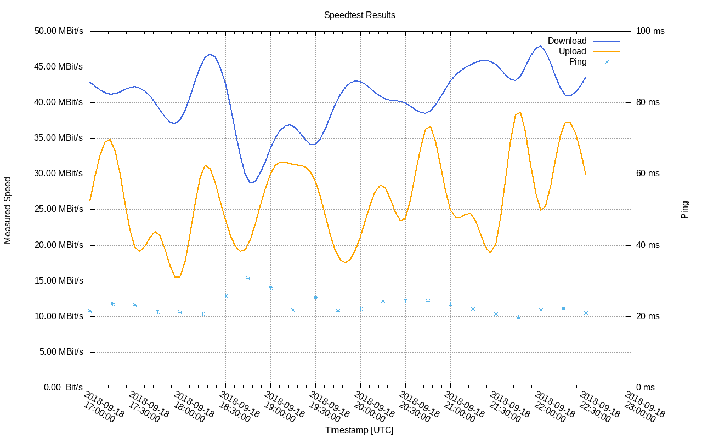
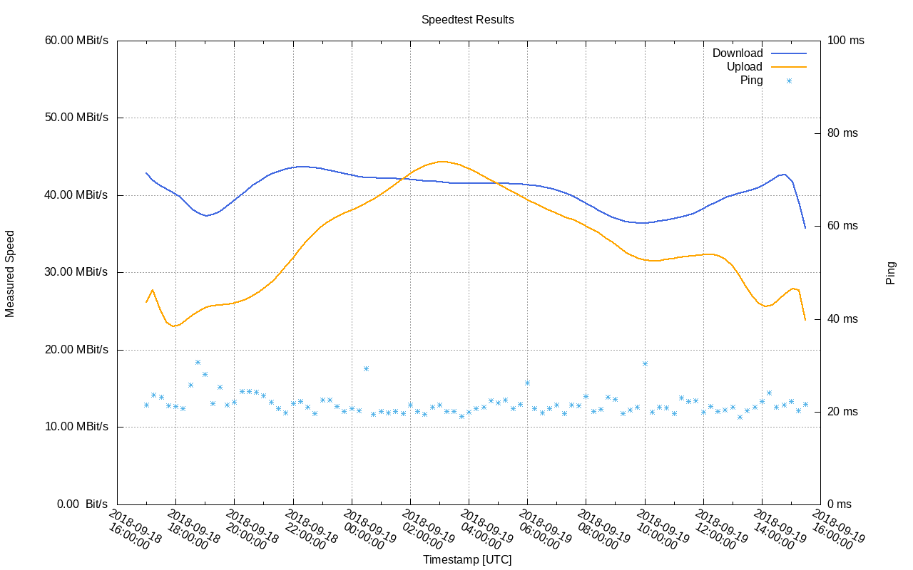
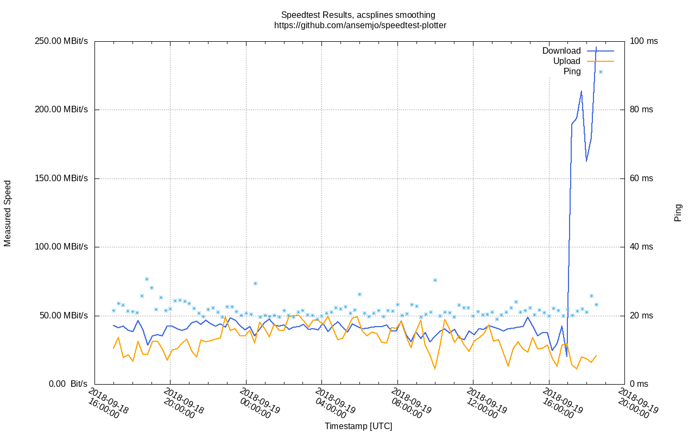

I am supposed to have a 500 Mbps internet line at home. Last week it really didn't feel like that
(again). Pages would take ages to load, streams would stutter miserably or simply abort and
downloading OS updates simply timed out. So I set out to measure my actual bandwidth over a longer
period of time.

<!--more-->

# speedtest-cli

Everybody probably knows sites like [speedtest.net](http://www.speedtest.net/),
[speedof.me](https://speedof.me/) and the
[various](https://kabel.vodafone.de/hilfe_und_service/speedtest)
[speedtest](http://speedtest.t-online.de/#/) [sites](https://www.verizon.com/speedtest/) hosted by
ISPs.

There is a [python tool](https://github.com/sivel/speedtest-cli) that uses speedtest.net's
infrastructure to measure your internet bandwidth using a server close to you. It can display the
results interactively and in JSON or CSV format.

Great! The CSV output looks simple enough:

    $ speedtest-cli --csv-header && speedtest-cli --csv
    Server ID,Sponsor,Server Name,Timestamp,Distance,Ping,Download,Upload,Share,IP Address
    4886,Stadtwerke Neumünster GmbH,Neumunster,2018-09-19T19:04:04.573450Z,54.730473843645846,32.37,152433588.21095023,34932876.622469135,,X.X.X.X

It has a timestamp, a ping, down- and upload measurements and some metadata about the server used.

There are probably better tools out there, especially ones that measure your ping _while_ you're
clogging the pipes to get ahold of phenomena like bufferbloat. But it's still great to get an idea
about your connection.

# rinse and repeat

To collect some measurements over a long period of time, you'll need to run `speedtest-cli` in
regular intervals. There are surely a number of ways to do that and the simplest would probably be
to just use a `while true` loop with a `sleep` command.

I chose to use a Docker container with `crond` running inside to allow for more precise scheduling.
It really is just an [alpine](https://hub.docker.com/_/alpine/) container with `speedtest-cli`
installed, which execs `crond` in the foreground and logs its measurements to the docker log. Start
the container on some server as close to your router as possible and let it do its thing for a few
hours or days.

You can find my project [on GitHub](https://github.com/ansemjo/speedtest-plotter).

# what now?

When you think you've had enough, run `docker logs` and look at your data.

Wonderful. What now?

Plot it!

Since CSV is such a universal format, you could easily open the `results.csv` in any tabular
calculation program and use their respective chart plugins - both Microsoft Excel and LibreOffice
Calc could easily handle that.

But that would feel repetitive as soon as you had to do it a second time for a second measurement
series. Of course, there are tools to create graphs on the commandline! After a quick search I found
exactly what I was looking for with [gnuplot](http://gnuplot.sourceforge.net/). I must admit, it did
not feel intuitive at all but fortunately you only have to do this part once.

After a couple of stackoverflow answers and a few pages of documentation, this is what I came up
with:

    set title "Speedtest Results, acspl smoothing\n\
      https://github.com/ansemjo/speedtest-plotter"
    set xlabel "Timestamp [UTC]"
    set xdata time
    set timefmt "%Y-%m-%dT%H:%M:%S.*Z"
    set xtics format "%Y-%m-%d\n%H:%M:%S" rotate by -30
    set ylabel "Measured Speed"
    set ytics format "%.2s %cBit/s" nomirror
    set yrange [0:*]
    set linetype 1 lw 2 lc rgb "royalblue"
    set linetype 2 lw 2 lc rgb "orange"
    set y2label "Ping"
    set y2tics format "%.0f ms" nomirror
    set y2range [0:100]
    set grid
    set datafile separator ","
    set terminal png size 1280, 800
    set output "results.png"
    plot for [col=7:8] "results.csv" using 4:col title col sm acspl, \
      '' using 4:6 title col axes x1y2 w points

## examples

Save your results in `results.csv` and the above script in `plotscript`. Then run
`gnuplot ./plotscript` and you'll be rewarded with a graph:

Leave the container running for a day, apply a different smoothing function and you'll end up with
something that clearly shows some variation with the time of day:

But that is still nowhere near the promised 500 Mbps? Have you tried .. you know .. turning it off
and on again?

A-ha! So a router reboot 'fixed' my slow connection? This is just the beginning of my debugging
effort but visualizing the data definitely helped.

# the project

I'll let the Docker container run for now. In the meantime you can take a look at the GitHub
repository of this project:

https://github.com/ansemjo/speedtest-plotter

It provides a nice makefile to ease many of the commands and everything is explained in the
[README](https://github.com/ansemjo/speedtest-plotter/blob/master/README.md).

And while you're at it, read [this wonderful article](http://tonsky.me/blog/disenchantment/) by
[@nikitonsky](https://twitter.com/nikitonsky) about modern bloat in programming languages and the
web in general.

Yeah I know, using Docker for a simple scriptable task definitely falls into this category aswell.
But the makefile provides a simple non-Docker approach, too. I promise!
