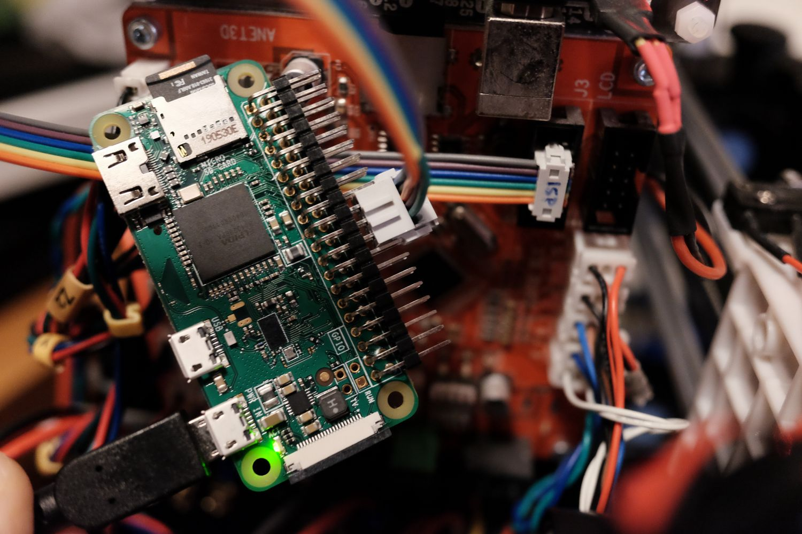

To keep things short: I've had an [Anet A8](https://all3dp.com/1/anet-a8-3d-printer-review-diy-kit/)
3D printer for a while now and wanted to flash an updated version of its
[Marlin](https://github.com/MarlinFirmware/Marlin) firmware.
For some reason however, the bootloader was broken. So I couldn't flash it with
`avrdude` by simply using a USB cable. For this case you can find lots of
tutorials on how to flash Arduino boards with a second Arduino. I didn't have a
second Arduino at the time though ... so why not just bit-bang it from a Raspberry
Pi instead?

<!--more-->

**Update:** I found out that you can also use FTDI breakout boards like the
[SparkFun FT232RL][sparkfun] or [Adafruit FT232H][adafruit]. The drivers come
preinstalled on Linux. I've documented the cabling and configuation [in my wiki][wiki].

[sparkfun]: https://www.sparkfun.com/products/12731 "SparkFun USB to Serial Breakout - FT232RL"
[adafruit]: https://www.adafruit.com/product/2264 "Adafruit FT232H Breakout - General Purpose USB to GPIO+SPI+I2C"
[wiki]: https://ansemjo.github.io/wiki/tips/arduino.html "Arduino Tips - ansemjo's docs"

Luckily I purchased a Raspberry Pi Zero W shortly before and I've quickly found
configuration examples how to use GPIO pins to program an Arduino. Most examples
use pins spread all around the header though and I wanted to use a more compact
footprint to ease wiring with Dupont cables a little.

There's a block of pins on the Raspberry header from pins 19 to 23 labelled with
`MOSI`, `GND`, `MISO`, `SCLK` .. perfect! Please use the following beatiful ASCII
graphics to help with wiring the Raspberry to the Anet's `J3` header. You'll only
need five female-to-female jumper cables:

```
      Anet J3         |          Raspberry Pi Header
      -------         |  ..
 3.3V | . . | SS      |  ..            | . . |
  GND | X X | Reset   |  17       3.3V | . . |
 MOSI | X X   SCK     |  19  (10) MOSI | X X | GND
   5V | . X | MISO    |  21  (09) MISO   X X | Reset (25)
   TX | . . | RX      |  23  (11) SCLK | X . |
      -------         |  ..            | . . |
```

The `X`-es indicate a connected wire. The six center pins on the Anet J3 header
should correspond to any other Arduino 6-pin ISP header, so you can make a more
permanent cable if you like, too.



I powered the Anet board externally with its usual power supply. Do not attempt
to connect the 5V pin to your Raspberry Pi. You'll likely just draw too much
current and shut your Pi down.

When everything is connected, install `avrdude` and append the following to the
global configuration file in `/etc/avrdude.conf`:

```
# avr programmer via linux gpio pins
programmer
  id    = "gpio";
  desc  = "Use the Linux sysfs to bitbang GPIO lines";
  type  = "linuxgpio";
  reset = 25;
  sck   = 11;
  mosi  = 10;
  miso  = 9;
;
```

Afterwards connect to your board with something like:

    sudo avrdude -p m1284p -c gpio -v

Obviously substitute the correct part if you're not using an Anet A8 (Sanguino
ATmega1284p).
